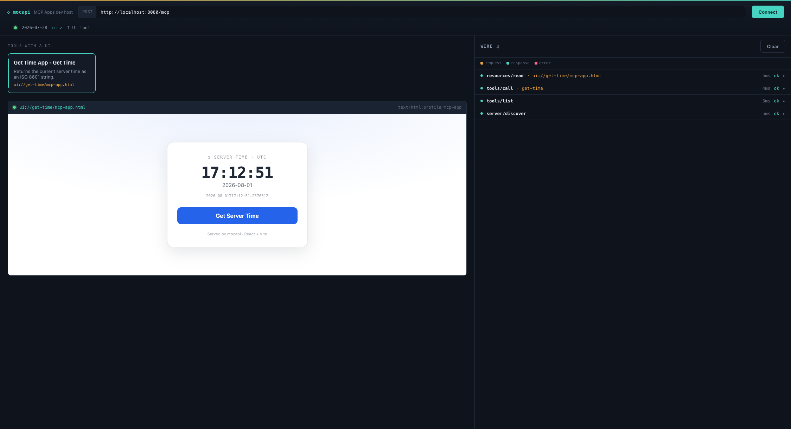

# MCP Apps

MCP Apps (`io.modelcontextprotocol/ui`) lets your server ship an
interactive HTML UI that an MCP host renders — in a sandboxed iframe —
in place of plain tool output. mocapi implements the **server** half
only: declaring `ui://` HTML resources and linking tools to them.
**mocapi does not provide the in-iframe JavaScript** — see
[Two halves, one boundary](#two-halves-one-boundary) below before you
start.

For the architecture behind this guide, see the
[MCP Apps design doc](../design/apps.md), and
[ADR-0033](../adr/0033-mcp-apps-module-and-ui-capability.md) /
[ADR-0034](../adr/0034-descriptor-meta-and-customizer-seams.md) for the
decisions.

A mocapi App, rendered end-to-end — a `ui://` resource in a sandboxed iframe,
linked to the tool that populates it. This is the [`get-time` example](../../examples/apps)
shown in the [dev host](../../examples/dev-host), whose Wire panel (right) shows the
underlying `2026-07-28` traffic:



## Two halves, one boundary

MCP Apps splits into a server surface and a host/in-iframe JS surface:

| | Who provides it |
|---|---|
| Serve `ui://` HTML resources, link tools to them, declare the `ui` capability | **mocapi** (`mocapi-apps`) |
| Sandbox handshake, `postMessage` JSON-RPC bridge, `ui/initialize`, display-mode negotiation, app-registered tools | **The MCP host** (e.g. the client application rendering the iframe) |
| The JS running *inside* your `ui://` HTML that talks to the host over `postMessage` | **You, using the official [`ext-apps` JS SDK](https://github.com/modelcontextprotocol/ext-apps)** — mocapi does not ship this |

mocapi serves your HTML bytes content-agnostically. It has no
`postMessage`/iframe-bridge code and never will under this design —
that layer belongs to the host and to whatever the in-iframe app links
against. **Go get the official JS SDK for the in-iframe side; this
guide only covers the server metadata that makes your resource
discoverable as an app.**

## Add the dependency

```xml
<dependency>
    <groupId>com.callibrity.mocapi</groupId>
    <artifactId>mocapi-apps</artifactId>
</dependency>
```

`MocapiAppsAutoConfiguration` activates automatically once `mocapi-apps`
is on the classpath (`@ConditionalOnClass`) — no explicit `@Enable...`
needed. Omitting the dependency leaves everything else in mocapi
unchanged: no descriptor gains `_meta`, and `@McpTool`/`@McpResource`
discovery behaves exactly as it does today.

## Declare a `ui://` resource with `@McpAppResource`

`@McpAppResource` is a specialization of `@McpResource` — it registers
through the same resource-discovery path, with the MIME type defaulted
to `text/html;profile=mcp-app` and the URI required to use the `ui://`
scheme:

```java
import com.callibrity.mocapi.apps.Csp;
import com.callibrity.mocapi.apps.McpAppResource;
import com.callibrity.mocapi.model.ReadResourceResult;
import org.springframework.stereotype.Component;

@Component
public class WeatherApp {

    @McpAppResource(
        uri = "ui://weather/dashboard",
        name = "Weather Dashboard",
        csp = @Csp(connect = "https://api.weather.com"))
    public ReadResourceResult dashboard() {
        return ReadResourceResult.ofText(
            "ui://weather/dashboard",
            "text/html;profile=mcp-app",
            """
            <!doctype html>
            <html>
              <head><title>Weather</title></head>
              <body><div id="root"></div>
                <!-- pin a specific version and add integrity="sha384-..." (Subresource
                     Integrity) once you know the real asset's hash — omitted here because
                     this URL is illustrative, not a real CDN asset. -->
                <script type="module" src="https://cdn.example.com/weather-app.js"></script>
              </body>
            </html>
            """);
    }
}
```

Like every `@McpResource` method, this can return a full
`ReadResourceResult` or one of the convenience return types — a
`String`/`CharSequence`, `byte[]`/`ByteBuffer`, or a Spring `Resource`
(see the [resources guide](resources.md#convenience-return-types-mcpresource)).
So the body above can also be a bare `return """<!doctype html>…""";`.
If the bundle is a static file, you usually don't need a resource method
at all — see [Serve a bundle from a file](#serve-a-bundle-from-a-file-mcpuiresource)
below.

The `<script>` in your HTML is where the official ext-apps JS SDK goes
— that script establishes the `postMessage` handshake with the host.
mocapi has no opinion on how you build or bundle it; serve it inline,
from an external CDN URL your CSP allows, or as a separate mocapi
resource.

### `@Csp` — declaring what the UI needs

`@Csp` lets you declare the CSP origins the host should allow the
iframe to reach. Empty arrays mean "no external access":

```java
@Csp(
    connect  = {"https://api.weather.com"},   // fetch/XHR/WebSocket targets
    resource = {"https://cdn.example.com"},   // scripts/styles/images
    frame    = {},                             // nested iframes allowed inside yours
    baseUri  = {})                             // allowed <base> targets
```

mocapi only *declares* this; the host is responsible for enforcing it
on the rendered iframe. You can also declare requested sandbox
permissions on `@McpAppResource` itself:

```java
@McpAppResource(uri = "ui://weather/dashboard", sandbox = {"allow-scripts"})
```

Both `csp` and `sandbox` show up in the resource's `_meta.ui` — see
[Wire shape](#wire-shape) below.

Every `String`/`String[]` attribute here — `@McpUi`'s `value`, `resource`,
and `visibility`; `@Csp`'s four domain lists; `@McpAppResource`'s
`sandbox` — resolves `${...}`/`#{...}` placeholders per element, the same
`mcpAnnotationValueResolver` convention the rest of mocapi's annotations
follow (see [Externalizing Metadata](externalizing-metadata.md)).
`McpUiReferenceValidator` compares the *resolved* `@McpUi` URI against
*resolved* resource URIs, so a shared placeholder like
`${app.dashboard-uri}` on both sides still matches after resolution.

### CSP/sandbox defaults and the `mocapi.apps.*` properties

A `@McpAppResource` that leaves `csp`/`sandbox` at their empty defaults
falls back to server-wide defaults from `mocapi.apps.*`:

```properties
mocapi.apps.csp.connect=https://api.example.com
mocapi.apps.csp.resource=https://cdn.example.com
mocapi.apps.csp.frame=
mocapi.apps.csp.base-uri=
mocapi.apps.sandbox=allow-scripts
```

The fallback applies **per CSP domain list**, not per-`@Csp`-instance: if
your resource declares `@Csp(connect = "https://api.example.com")` and
leaves `resource`/`frame`/`baseUri` empty, those three fall back to the
matching `mocapi.apps.csp.*` default while `connect` keeps its literal
value. `sandbox` falls back as a whole when left at `{}`.

This is deliberately per-list rather than "annotation present vs.
absent": Java gives no reflective way to tell "`@Csp` was written with no
elements" apart from "`@Csp` wasn't written at all" — both produce the
identical all-empty default instance. `sandbox`'s `{}` default has the
same limitation. If you need a resource with *zero* CSP/sandbox even
though a server-wide default is configured, that specific combination
isn't expressible today — declare the resource without a global default,
or accept the default.

Add `@McpUi` to an existing `@McpTool` method to tell the host which
`ui://` resource renders that tool's results:

```java
import com.callibrity.mocapi.api.tools.McpTool;
import com.callibrity.mocapi.apps.McpUi;

@McpTool(name = "get_weather", description = "Get the current weather")
@McpUi("ui://weather/dashboard")
public WeatherResult getWeather(WeatherArgs args) {
    return weatherService.current(args.location());
}
```

`@McpUi` changes no discovery or invocation behavior — the tool is
still discovered and called exactly as `@McpTool` alone would. It only
adds `_meta.ui.resourceUri` to the tool's descriptor. The data your UI
renders is still the tool's ordinary `CallToolResult`
(`structuredContent` is the typical vehicle) — there's no separate
context object to inject.

By default `visibility` is `["model", "app"]` — both the model and the
in-app UI can see the tool. Narrow it if only one side should:

```java
@McpUi(value = "ui://weather/dashboard", visibility = "app")
```

`visibility` here is the MCP Apps UI-access axis (model vs. app), not
mocapi's authorization-Guard `visibility`
([guards guide](guards.md)) — the two are unrelated concepts that
happen to share a name. mocapi emits Apps `visibility` as metadata
only; it does not enforce it.

## Serve a bundle from a file (`@McpUi(resource=…)`)

When your UI is a static bundle on the classpath, you don't need a
resource method at all. Point `@McpUi.resource` at the bundle and mocapi
contributes the `ui://` resource for you
([ADR-0036](../adr/0036-mcpui-serve-mode.md)):

```java
@McpTool(name = "get_weather", description = "Get the current weather")
@McpUi(value    = "ui://weather/dashboard",
       resource = "classpath:/ui/weather-dashboard.html")
public WeatherResult getWeather(WeatherArgs args) {
    return weatherService.current(args.location());
}
```

That single tool is the whole server surface — no `@McpAppResource`
method. mocapi serves the file's bytes at `ui://weather/dashboard` as
`text/html;profile=mcp-app`, resolved **once at startup** via Spring's
`ResourceLoader` (so `classpath:/…`, `file:/…`, and any other
`ResourceLoader` location work). A missing file fails the boot with a
clear error, not a blank iframe at render time.

- **The URI is logical, the location is fixed.** `value()` is the wire
  identity; the bytes come only from the literal `resource` string.
  Neither is ever built from request input — there is no way for a client
  to make the server read an arbitrary file.
- **Reuse is fine.** Several tools may link the same `value()`; mocapi
  registers one resource. Two tools naming the same `value()` with
  *different* `resource` locations fails the boot.
- **Serve-mode is the thin, public path.** These resources carry no
  guards, no observability, and a default `_meta.ui` (default CSP, no
  extra sandbox). When you need guards, custom `@Csp`/sandbox,
  observability, or generated content, declare an `@McpAppResource`
  method (with any [return type](resources.md#return-values)) and leave
  `resource` blank — `McpUiReferenceValidator` still checks the URIs
  line up at boot.

Choose per app: `@McpUi(resource=…)` for a static bundle you just want
served; `@McpAppResource` when the resource needs logic or policy.

## What the host does with it

Once your server declares these, the flow from a host's perspective is:

1. **Discovery** — `server/discover` reports the
   `io.modelcontextprotocol/ui` capability (mocapi always emits it once
   `mocapi-apps` is on the classpath — no `initialize` handshake to
   gate on). `resources/list` shows your `ui://` resources with their
   CSP/sandbox `_meta.ui`; `tools/list` shows tools carrying
   `_meta.ui.resourceUri`.
2. **Render** — the model calls your tool; mocapi returns a normal
   `CallToolResult`. Seeing `_meta.ui.resourceUri` on the tool
   descriptor, the host fetches the linked `ui://` resource via
   `resources/read` and renders it in a sandboxed iframe, applying the
   declared CSP/sandbox. Your in-iframe JS (the ext-apps SDK) then
   completes the handshake with the host and receives the call result.
3. **App calls a server tool** — an action inside your rendered UI
   (e.g. a "Refresh" button) goes App → Host → Server, arriving at
   mocapi as a completely ordinary `tools/call`. Nothing about that
   request is Apps-specific on the server side.

All of steps 2 and 3 past `resources/read` are host/iframe concerns —
mocapi's job ends at serving descriptors and HTML bytes.

## Wire shape

What actually goes over JSON-RPC once you've applied `@McpAppResource`
and `@McpUi`:

```jsonc
// tools/list entry
{ "name": "get_weather", "description": "Get the current weather", "inputSchema": {…},
  "_meta": { "ui": { "resourceUri": "ui://weather/dashboard", "visibility": ["model", "app"] } } }

// resources/list entry (static default)
{ "uri": "ui://weather/dashboard", "name": "Weather Dashboard",
  "mimeType": "text/html;profile=mcp-app",
  "_meta": { "ui": { "csp": { "connectDomains": ["https://api.weather.com"] } } } }

// resources/read content
{ "uri": "ui://weather/dashboard", "mimeType": "text/html;profile=mcp-app",
  "text": "<!doctype html>…" }

// server/discover capabilities (excerpt)
{ "capabilities": { "extensions": {
    "io.modelcontextprotocol/ui": { "mimeTypes": ["text/html;profile=mcp-app"] } } } }
```

## Building the in-iframe side

Everything after "the host fetches your HTML" is JavaScript running
inside the iframe, talking to the host over `postMessage`. mocapi does
not provide this — use the official
[`modelcontextprotocol/ext-apps` JS SDK](https://github.com/modelcontextprotocol/ext-apps)
to handle the sandbox handshake (`ui/initialize`), receive tool-result
data, and (if your UI needs it) call back into server tools. Treat your
`ui://` resource's HTML as an ordinary static web app that happens to
be served by mocapi and rendered in a host-controlled iframe — the SDK
and your app's own JS own everything that happens after the bytes leave
`resources/read`.

## What's out of scope in v1

- No per-response `_meta.ui` override on `resources/read` content
  (draft-only in the spec) — v1 supports only the static
  `resources/list`/`resources/read` descriptor form shown above.
- No call-time `UiContext` for injecting UI metadata dynamically per
  invocation — the tool↔UI link is static, resolved at descriptor-build
  time, before any call happens.
- No app-registered tools or display-mode negotiation — both are
  host/iframe concerns.

See the [design doc](../design/apps.md) for the full rationale.
